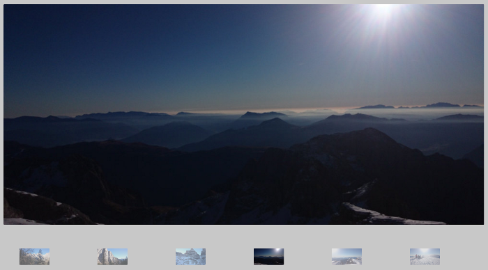

#WebImageViewer

A simple but flexible image gallery for websites.

Main features:

* One main image view
* A variable number of your choice of thumb images [not mandatory]
* No buttons in order to go on or go back through images:
  * Click on the right of the main image for present the next image
  * Click on the left of the main image for come back to the last image
  * Click on the thumb that you want to see


There is not a predefined layout. You must do it on your own.  
This provide a lot of customization possibilites.
Anyway, I have developed some layouts, some of them uses 
Bootstrap. 

Currently, the images are show in the *background-image* CSS property.
I'm developing the classic ** HTML version.

## Online examples
You can observe some examples of the ImageGallery
in this webpages:

* [My personal webpage](http://amedeosetti.com)
* [Another webpage - Not active yet](http://amedeosetti.com)

## The first example 
#### index.html

```html
<!-- Set the main image -->
<div class="imageView" id="imageView1"> </div>
<div class="container-fluid" style="padding-top: 50px; padding-bottom: 25px; text-align: center;">
<row>
  <!-- Set the thumb images -->
  <div class="thumbView" id="thumbView0"></div>
  <div class="thumbView" id="thumbView1"></div>
  <div class="thumbView" id="thumbView2"></div>
</row>
```
We load the images with the following script:

```javascript
<script type="text/javascript">
  // Set the main image id to the ImageGallery
  ImageGallery.mainView = 'imageView1';
  // Set the images you want to show.
  ImageGallery.images = ['images/t1.JPG', 'images/t2.jpg', 'images/t3.JPG', 'images/t4.JPG', 'images/t5.jpg', 'images/t6.JPG', 'images/t7.JPG', 'images/t8.JPG', 'images/t1.JPG', 'images/t2.jpg', 'images/t3.JPG', 'images/t4.JPG', 'images/t5.jpg', 'images/t6.JPG', 'images/t7.JPG', 'images/t8.JPG'];
  // Setup the ImageGallery
  ImageGallery.setup();
</script>
```

In this example we set the main image, of the class named *imageView*,
and we set an id for this main image.
We also created three thumbs images, with the class *thumbView*.
You can show the results in the following image:


## The second example
#### bootstrap-example-1.html
In this example we use Bootstrap in order to layout
the thumbs and main image positions.

```html
<div class="col-lg-12 col-md-12 col-xs-12" style="background-color: rgba(200,200,200,1.0)">
      <div class="container-fluid">
      </br>
        <div class="imageView" id="imageView1"></div>
        <div class="container-fluid" style="padding-top: 50px; padding-bottom: 25px; text-align: center;">
          <row>
            <div class="col-lg-2 col-md-2 col-xs-2">
              <div class="thumbView" id="thumbView0"></div>
            </div>
            <div class="col-lg-2 col-md-2 col-xs-2">
              <div class="thumbView" id="thumbView1"></div>
            </div>
            <div class="col-lg-2 col-md-2 col-xs-2">
              <div class="thumbView" id="thumbView2"></div>
            </div>
            <div class="col-lg-2 col-md-2 col-xs-2">
              <div class="thumbView" id="thumbView3"></div>
            </div>
            <div class="col-lg-2 col-md-2 col-xs-2">
              <div class="thumbView" id="thumbView4"></div>
            </div>
            <div class="col-lg-2 col-md-2 col-xs-2">
              <div class="thumbView" id="thumbView5"></div>
            </div>
          </row>
        </div>
      </div>
    </div>
```

The loading part is the same as the first example.
The results is the following:



##Dependencies
The ImageGallery uses jQuery in order to detect the touch points
in the images, so you need jQuery in order to go through the images.

Bootstrap is optional.
